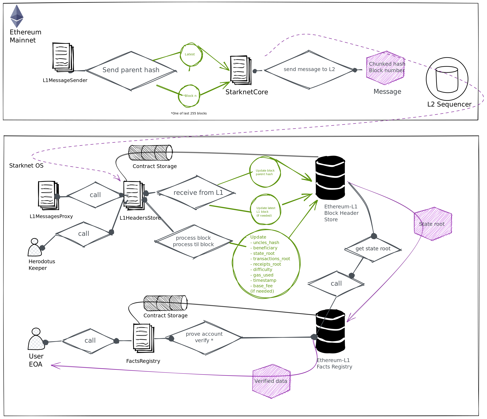

# Arquitectura Herodotus

Cada despliegue de contratos inteligentes de Heródoto que admite una cadena específica consta de los siguientes contratos:

1. **Commitments inbox:**  Este contrato es responsable de procesar y verificar la validez de otros compromisos de la cadena, como bloqueos o raíces estatales.
2. **Headers store:**  Esto contrata almacena y permite procesar encabezados desde un punto dado hasta la génesis al afirmar que `blockhash(x - 1) = parenthash(x)`.
3. **Facts registry:** Este contrato realiza la verificación de Storage Proof  y almacena los valores solicitados en su estado.

<em></em>

