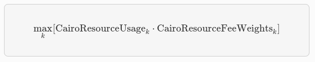
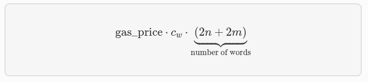
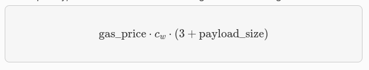
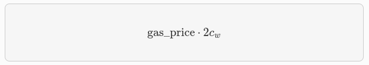
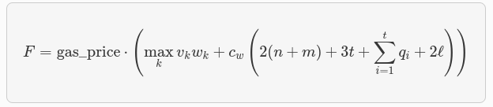

# Builtins y Mecanismos de Fee
En esta sección, revisaremos el mecanismo de tarifas de Starknet Alpha. Si desea omitir la motivación y profundizar en el mecanismo.

Los usuarios pueden especificar la máxima tarifa que están dispuestos a pagar por una transacción a través del campo `max_fee`.

La única limitación en el secuenciador (impuesta por Starknet OS) es que la tarifa real cobrada está acotada por `max_fee`, pero por ahora, StarkWare’s secuenciador solo cobrará la tarifa requerida para cubrir el costo de la prueba (potencialmente menos que la tarifa máxima).

Actualmente, el secuenciador solo tiene en cuenta los costos de L1 relacionados con la presentación de la prueba. Hay dos componentes que afectan el rastro de L1 de una transacción:

1. **Complejidad computacional**: cuanto más pesada sea la transacción, mayor será su parte en el costo de verificación de la prueba.

2. **Datos en cadena**: costo de datos de L1 originados por la disponibilidad de datos y mensajes de L2 → L1.

Las unidades de tarif están denominadas en **ETH**, _(esto puede cambiar en versiones futuras)_. Cada transacción está asociada con una estimación de gas, y al combinar esto con el precio del gas, se obtiene la tarifa estimada.

## Descripción general de alto nivel
Analicemos la métrica correcta para medir la complejidad de una transacción. Para simplificar, ignoraremos las funciones incorporadas de Cairo con fines de explicación, y luego veremos cómo abordarlas.

### Sin builtins incorporados
Recordemos que la ejecución de un programa Cairo produce una traza de ejecución. Al probar un bloque de Starknet, agregamos todas las transacciones que aparecen en ese bloque a la traza de ejecución.

El Prover de Starknet genera pruebas para trazas de ejecución, con una longitud máxima **`L`**, derivada de las especificaciones de la máquina de pruebas y la latencia de la prueba deseada.

Es sencillo hacer un seguimiento de la longitud de la traza de ejecución asociada con cada transacción. Cada operación sobre field elements _(como verificar la suma/multiplicación sobre el field)_ requiere el mismo número constante de celdas de traza (trace cells). 

Cuando mencionamos **sin builtin incorporados** nos referimos a un escenario en el que todas las operaciones en el programa Cairo son operaciones básicas y no implican el uso de funciones más complejas, como las que encontramos **con builtin incorporados**. En esta situación, la ejecución de una operación simple, como una suma, requerirá menos celdas de traza que una operación más compleja como la función Pedersen. Es evidente que la función Pedersen ocupará más celdas de traza debido a su naturaleza más compleja en comparación con una simple suma.

### Con builtins incorporados
La traza de ejecución de Cairo está separada, y cada builtin incorporado tiene su propia ranura. Debemos tener en cuenta esta asignación de ranura al determinar la tarifa.

Repasemos primero un ejemplo concreto. Imagina que la traza de ejecución tiene una capacidad máxima que ocupará el Prover:

- 500.000.000 pasos de Cairo
- 20.000.000 hashes de Pedersen
- 4.000.000 verificaciones de firma
- 10.000.000 comprobaciones de rango

La prueba se cerrará y se enviará a L1 cuando cualquiera de estos componentes se llene. 

>Es importante darse cuenta de que la división en funciones incorporadas debe estar predeterminada. No podemos decidir sobre la marcha tener una prueba con **20.000.001 Pedersen**.

Supongamos, por ejemplo, que una transacción utiliza **10.000 pasos de Cairo** y **500 hashes de Pedersen**. Podemos acomodar como máximo **40.000 transacciones** de este tipo en nuestro rastro hipotético **(20.000.000/500)**. Por lo tanto, la tarifa de la transacción se relaciona con **1/40.000** del costo de enviar la prueba.

Es importante notar que el número de pasos de Cairo no es el factor limitante en esta estimación del rendimiento de la transacción _(ya que **500,000,000/10,000 > 20,000,000/500**)_. Con este ejemplo en mente, ahora podemos formular la tarifa exacta asociada con el cómputo de L2.

### Caso general
Para cada transacción, el secuenciador calcula un vector `CairoResourceUsage` que contiene:

* Número de pasos de Cairo
* Número de aplicaciones de cada función incorporada de Cairo (por ejemplo, cinco comprobaciones de rango y dos hashes de Pedersen)

El secuenciador cruza esta información con el vector `CairoResourceFeeWeights`. Para cada tipo de recurso (paso o una aplicación específica de función incorporada), `CairoResourceFeeWeights` tiene una entrada que especifica el costo de gas relativo de ese componente en la prueba.

Volviendo al ejemplo anterior, si el costo de enviar una prueba con **20.000.000 hashes de Pedersen** es aproximadamente **5m** de gas, entonces el número de pasos de la función incorporada de Pedersen es **0.2 gas** por aplicación (**5,000,000/20,000,000**). El secuenciador tiene un vector de pasos predefinidos, de acuerdo con los parámetros de la prueba.

El secuenciador cobrará solo según el factor limitante. Por lo tanto, la tarifa está correlacionada con:

<em></em>

Donde `k` enumera los componentes de recursos de Cairo, es decir, el número de pasos y funciones incorporadas utilizados.

Los pasos son:

* **Paso de Cairo:** 0.01 gas/paso
* **Pedersen:** 0.32 gas/aplicación
* **Poseidon:** 0.32 gas/aplicación
* **Comprobación de rango:** 0.16 gas/aplicación
* **ECDSA:** 20.48 gas/aplicación
* **Bitwise:** 0.64 gas/aplicación
* **EC_OP:** 10.24 gas/aplicación

## Datos On-Chain
Los datos en cadena asociados con una transacción están compuestos por tres partes:

* Actualizaciones de Storage.
* Mensajes L2 → L1.
* Contratos implementados.

### Actualizaciones de Storage
Cuando una transacción actualiza una clave en el almacenamiento de algún contrato, los siguientes datos llegan a L1:

* Contract_address
* Número de claves actualizadas en ese contrato
* Clave para actualizar
* Nuevo valor

>Nota: Solo el valor más reciente llega a L1. Es decir, la tarifa de la transacción solo depende del número de actualizaciones de storage únicas (si la misma celda de storage se actualiza varias veces dentro de la transacción, la tarifa sigue siendo la de una única actualización).

La tarifa de actualización de storage asociada para una transacción que actualiza `n` contratos únicos y `m` claves únicas es:

<em></em>

Donde `cw` es el costo de `calldata` (en gas) por palabra de 32 bytes.

>Nota: Hay muchas posibles mejoras a la estimación pesimista anterior que se presentarán gradualmente en futuras versiones de Starknet. Por ejemplo, si diferentes transacciones dentro del mismo bloque actualizan la misma celda de almacenamiento, no es necesario cobrar ambas (solo el valor más reciente llega a L1). En el futuro, Starknet podría incluir un mecanismo de reembolso para tales casos.

### Mensajes L2 → L1
Cuando se realiza una transacción que invoca la llamada del sistema `send_message_to_l1` y se incluye en una actualización de estado, los siguientes datos llegan a la capa L1 (capa de destino):

1. **L2 sender address:** Es la dirección del remitente en la capa L2, es la dirección de la entidad o contrato en la capa 2 que inició la transacción o envió el mensaje.

2. **L1 destination address:** Es la dirección de destino en la capa L1. Esta dirección indica el contrato o entidad en la capa 1 que recibirá el mensaje enviado desde la capa 2.

3. **Payload size:** Es el tamaño del contenido útil o información que se envía en el mensaje. Representa la cantidad de datos que se transmiten desde la capa 2 a la capa 1.

4. **Payload _(lista de field element)_:** Es la lista de elementos o datos que constituyen el contenido útil o payload del mensaje enviado desde la capa 2 a la capa 1.

En cuanto a la tarifa asociada con un solo mensaje de la capa L2 a la capa L1, se calcula utilizando la siguiente fórmula:

<em></em>

Donde:
- `gas_price` es el precio del gas (unidad de costo) establecido en la transacción.
- `cw` es el costo de calldata (datos de llamada) en gas por palabra de 32 bytes.
- `payload_size` es el tamaño del contenido útil o payload del mensaje en bytes.

Esta fórmula te permite determinar el costo total de enviar un mensaje desde la capa L2 a la capa L1, tomando en cuenta el precio del gas, el costo de calldata y el tamaño del contenido enviado.

### Contratos implementados
Cuando una transacción que eleva la llamada del sistema `deploy` se incluye en una actualización de estado, los siguientes datos llegan a L1:

* **Dirección del contrato.**
* **Class Hash.**

La tarifa asociada con una implementación única es:

<em></em>

Donde `cw` es el costo de calldata (en gas) por palabra de 32 bytes.

## Tarifa total

La tarifa para una transacción con:

* La utilización de Cairo se representa mediante el vector `v`, donde las entradas de `v` corresponden al número de pasos y al número de aplicaciones por builtin incorporado.
* `n` actualizaciones de contratos únicos
* `m` actualizaciones de claves únicas
* `t` mensajes con tamaños de carga `q1,...,qt`
* `ℓ` implementaciones de contratos

Está dada por:

<em></em>

Donde `w` es el vector de pasos discutido anteriormente y `cw` es el costo de calldata (en gas) por palabra de 32 bytes.

La tarifa se cobra atómicamente durante la ejecución de la transacción en L2. El SO de Starknet realiza una transferencia del ERC-20 asociado con la tarifa, con una cantidad igual a la tarifa pagada, utilizando al remitente de la transacción como emisor y al secuenciador como receptor.