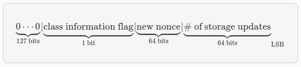

# Data Avalability
En la etapa actual de Alpha, Starknet opera en modo ZK-Rollup. Esto significa que al aceptar una actualización de estado en la cadena, la diferencia de estado entre el estado anterior y el nuevo se envía como datos de llamada (calldata) a Ethereum.

Estos datos permiten a cualquiera que observe Ethereum reconstruir el estado actual de Starknet.

Para actualizar el estado de Starknet en L1, es suficiente enviar una prueba válida, sin información sobre las transacciones o los cambios particulares que causó esta actualización.

Consecuentemente, se debe proporcionar más información para permitir que otras partes rastreen localmente el estado de Starknet.

Datos en la cadena: después de v0.11.0 Formato v0.11.0 Las diferencias de estado contienen información sobre cada contrato cuyo almacenamiento se ha actualizado, así como información adicional sobre los despliegues de contratos.

Para cada contrato afectado, tenemos:

* **La dirección del contrato**
* **Una sola palabra que codifica:**
    * Un indicador de información de clase (0 = solo actualizaciones de almacenamiento / 1 = el contrato fue desplegado o reemplazado en esta actualización de estado). Cuando este indicador está activado, habrá una palabra adicional antes de la sección de actualizaciones de almacenamiento, que contiene el nuevo hash de clase.
* **Nonce**
* **num_of_storage_updates** (número de actualizaciones de almacenamiento).

A continuación se muestra 


<div align="center">
<em>Así debe de ser el formato esperado</em>
</div>

Para cada actualización de almacenamiento:

* **clave:** la dirección dentro del almacenamiento del contrato donde se actualiza el valor
* **valor:** el nuevo valor

A continuación, se proporciona información sobre las clases declaradas y el número de clases (Cairo 1.0) presentes en el bloque.

Para cada clase, se incluyen los siguientes detalles:

1. Hash de la clase.
2. Hash de la clase compilada.

## Ejemplos después la v0.11.0
A continuación, mostramos un ejemplo de datos en la cadena que se extrajeron de L1 y procedemos a decodificarlo según el formato mencionado anteriormente.

```bash
[
1,
2019172390095051323869047481075102003731246132997057518965927979101413600827,
18446744073709551617,
100,
200,
1,
1351148242645005540004162531550805076995747746087542030095186557536641755046,
558404273560404778508455254030458021013656352466216690688595011803280448032
]
```
* El primer elemento `1`, es el número de contratos cuyo estado se actualizó.
* El segundo elemento, `2019172390095051323869047481075102003731246132997057518965927979101413600827`, es la dirección del primer (y único) contrato cuyo estado cambió, recordamos que es un felt su expresión hexadecimal sería `0x0476cfa27c83ea2498c4fb61972c2b80d2b1cd500986a881ec3c4e5b4f726e3b`.
* El tercer elemento, 18446744073709551617, que es 2^64+1, codifica lo siguiente:
    * El indicador de información de clase es 0, es decir, el contrato no se desplegó ni se reemplazó, por lo que no debemos tratar la siguiente palabra como el hash de clase.
    * El nuevo nonce es 1.
    * Se actualizó una celda de almacenamiento.
* Los dos elementos siguientes, `100` y `200`, codifican la actualización de almacenamiento (el valor de la clave 100 se estableció en 200).
* A continuación, tenemos la sección de declaraciones nuevas: `1` significa que tuvimos una única declaración v2 en esta actualización de estado, y los dos elementos siguientes, codifican el `class hash` y el `class hash compile` del `class declare`.


## Formato Anterior a la 0.11
Las state diffs contienen información sobre cada contrato cuyo storage se ha actualizado, así como información adicional sobre los despliegues de contratos. Esas diferencias se envían como un arreglo uint256[] como parte de los datos de llamada (calldata), y se codifican de la siguiente manera:

* Número de celdas que codifican los despliegues de contratos.
* Para cada contrato desplegado, tenemos:
    * contract_address: la dirección del contrato desplegado.
    * contract_hash: el hash de la clase.
* Número de contratos cuyo almacenamiento se actualiza.
* Para cada contrato de ese tipo, tenemos:
    * contract_address: la dirección del contrato.
    * num_of_storage_updates: el número de actualizaciones de almacenamiento.
    * nonce,νmofs→ra≥actualizaciones: un valor uint256 que codifica tanto el número de actualizaciones de almacenamiento para ese contrato como el nonce actualizado:


<div align="center">
<em>Así era el formato esperado antes de 0.11</em>
</div>

* Para cada actualización de almacenamiento:
    * clave: la dirección dentro del almacenamiento del contrato donde se actualiza el valor
    * valor: el nuevo valor

## Ejemplos antes la v0.11.0
A continuación, mostramos un ejemplo de datos en cadena que se extrajeron de L1 y se decodificaron según el formato anterior.

```bash
[
2,
2472939307328371039455977650994226407024607754063562993856224077254594995194,
1336043477925910602175429627555369551262229712266217887481529642650907574765,
5,
2019172390095051323869047481075102003731246132997057518965927979101413600827,
18446744073709551617,
5,
102,
2111158214429736260101797453815341265658516118421387314850625535905115418634,
2,
619473939880410191267127038055308002651079521370507951329266275707625062498,
1471584055184889701471507129567376607666785522455476394130774434754411633091,
619473939880410191267127038055308002651079521370507951329266275707625062499,
541081937647750334353499719661793404023294520617957763260656728924567461866,
2472939307328371039455977650994226407024607754063562993856224077254594995194,
1,
955723665991825982403667749532843665052270105995360175183368988948217233556,
2439272289032330041885427773916021390926903450917097317807468082958581062272,
3429319713503054399243751728532349500489096444181867640228809233993992987070,
1,
5,
1110,
3476138891838001128614704553731964710634238587541803499001822322602421164873,
6,
59664015286291125586727181187045849528930298741728639958614076589374875456,
600,
221246409693049874911156614478125967098431447433028390043893900771521609973,
400,
558404273560404778508455254030458021013656352466216690688595011803280448030,
100,
558404273560404778508455254030458021013656352466216690688595011803280448031,
200,
558404273560404778508455254030458021013656352466216690688595011803280448032,
300,
1351148242645005540004162531550805076995747746087542030095186557536641755046,
500
]
```
* El primer elemento `2`, es el número de celdas que codifican la implementación de contratos.
* Los dos siguientes elementos describen una única implementación de contrato con los siguientes parámetros:
    * dirección_contrato:
```bash
2472939307328371039455977650994226407024607754063562993856224077254594995194
```

* hash_contrato:
```bash
1336043477925910602175429627555369551262229712266217887481529642650907574765
```

* El siguiente elemento `5` (índice 3 en el array), es el número de contratos cuyo almacenamiento se actualizó. Tomaremos solo el primer contrato como ejemplo.
    * dirección_contrato:
```bash
2019172390095051323869047481075102003731246132997057518965927979101413600827
```   

* Después de la dirección de contrato mencionada anteriormente, tenemos `18446744073709551617` (índice 8 en el array), que es `2^64+1` , por lo tanto:
    * El nuevo nonce del contrato es 1.
    * Se actualiza una clave de almacenamiento.
    * El valor en la clave 5 se cambió a 102.

Las siguientes 4 actualizaciones de almacenamiento de contratos se interpretan de la misma manera.

Extracción desde Ethereum Los datos descritos anteriormente se envían a través de varias transacciones de Ethereum, cada una de las cuales contiene una parte de esta matriz como calldata. Cada nuevo bloque de Starknet tiene sus transacciones de difusión de estado asociadas.

Puede encontrar [el código para extraer estos datos](https://github.com/eqlabs/pathfinder/blob/2fe6f549a0b8b9923ed7a21cd1a588bc571657d6/crates/pathfinder/src/ethereum/state_update/retrieve.rs) de Ethereum en el repositorio de Pathfinder.

