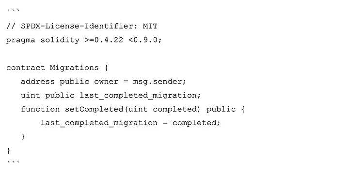
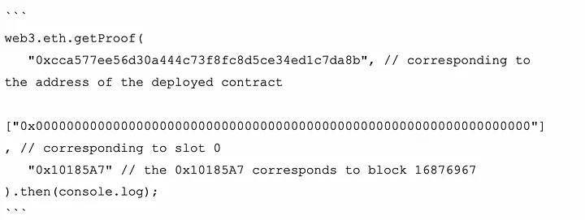
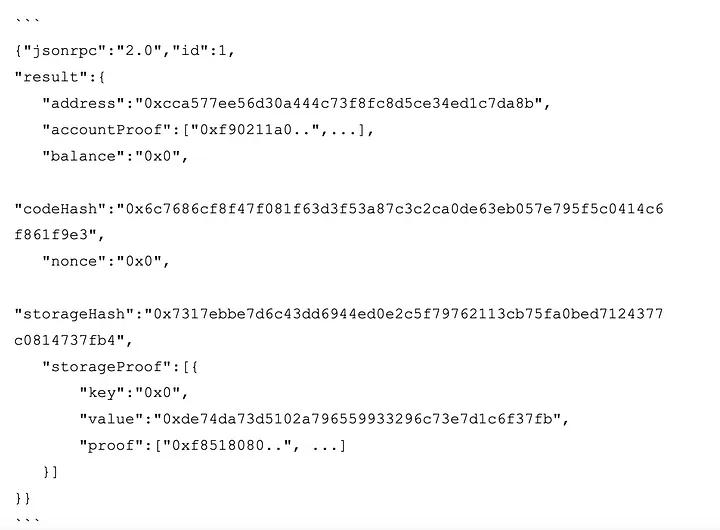

# Ejemplos Storage Proof
Generar Storage Proof en cadenas compatibles con EVM es sencillo. Por ejemplo, la biblioteca Web3.js tiene la función `getProof` que puede generar pruebas del estado de un contrato en Ethereum (y otras cadenas compatibles con EVM como Polygon, BSC, L2 Optimism...). Una dirección de contrato y la ranura de almacenamiento para el contrato deben ser pasados a la función.

En Ethereum, los contratos inteligentes utilizan un almacén de clave-valor para almacenar los datos en su almacén. Cada dato se almacena en una ubicación específica conocida como `ranura de almacenamiento`. Las ranuras de almacenamiento son ubicaciones de memoria dentro del almacenamiento del contrato y se identifican mediante un índice único. Veamos un ejemplo de contrato inteligente con el siguiente código desplegado en la mainnet de Ethereum.

<em></em>

La variable owner se almacenaría en la ranura `0`. Ahora, para generar la prueba de que el owner de este contrato era una `dirección A`, podemos utilizar la función `getProof` de la siguiente manera:

<em></em>

El resultado del código anterior es algo parecido a esto:

<em></em>

El `storageProof` devuelto contiene la prueba de almacenamiento para la variable `owner`. Dado que Ethereum utiliza Merkle Patricia Trees para comprometer su estado, el estado de las cuentas y su almacenamiento, el almacenamiento generado puede ser utilizado para probar una ranura de almacenamiento (o estado de la cuenta). Sin embargo, como se ha indicado anteriormente, estas pruebas no son lo suficientemente escalables como para discutir las transferencias de mensajes entre cadenas, para ello el uso de complejas matemáticas ZK sobre esto puede disminuir el cálculo necesario para verificar la prueba.

