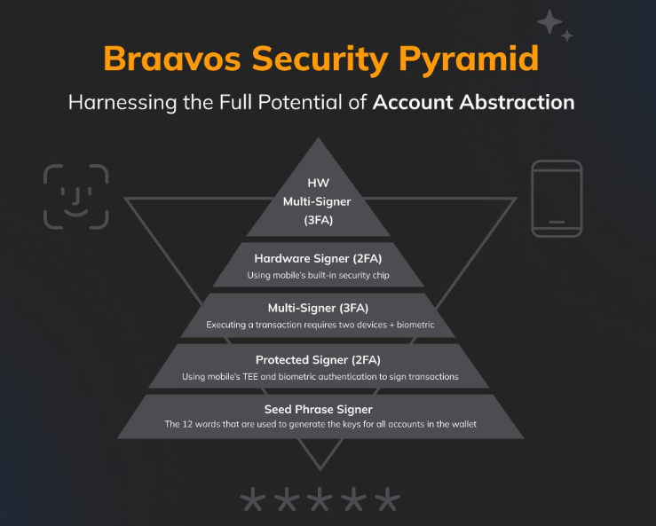

# My Braavos - Secp256r1
Comencemos explorando un dato interesante relacionado con la curva elíptica vista en capítulos anteriores, la `secp256k1`. En este contexto, la `k` hace referencia a [**Koblitz**](https://es.wikipedia.org/wiki/Neal_Koblitz), un destacado matemático cuyas contribuciones fueron fundamentales para el desarrollo de la criptografía y la teoría de números.

Por otro lado, en el caso de `secp256r1`, la `r` significa `random`, resaltando el énfasis en el proceso de selección aleatoria de parámetros utilizado en esta curva elíptica.

Braavos ha incorporado la firma y validación de transacciones utilizando `secp256r1`, lo que brinda una excelente experiencia al usuario final al permitir transacciones con firma biométrica directamente en el dispositivo del usuario, añadiendo así un nivel adicional de seguridad. Puedes encontrar más detalles sobre esta implementación en el [blog de Braavos](https://braavos.app/account-abstraction-security-pyramid/), donde presentan una interesante Pirámide de Seguridad AA.

<em></em>

Podemos ver en la cúspide de la pirámide al Multi-Signer (3FA). El Multi-Signer combina la protección de la frase de recuperación (seed phrase) en la extensión del navegador y el Hardware Signer o Protected Signer utilizando el dispositivo móvil.

Ahora se requieren dos firmas de dos claves diferentes para ejecutar la transacción en la cadena, obteniendo una autenticación de 3FA:

* **Algo que sabemos:** la clave derivada de tu frase de recuperación en la extensión del navegador.
* **Algo que tenemos:** tu dispositivo móvil.
* **Algo que somos:** tu huella dactilar o identificación biométrica facial.

Cabe destacar que aunque se ha agregado otro firmante, no se ha añadido otra seed phrase, esto también tiene el beneficio adicional de alejarse de las seed phrase a una mejor seguridad en los dispositivos móviles/computadoras portátiles modernas, y seguridad superior cuando el dispositivo del usuario admite un chip de seguridad dedicado, como el [elemento seguro Titan de Android](https://cloud.google.com/blog/products/identity-security/titan-in-depth-security-in-plaintext) o [Enclave Secure de Apple](https://support.apple.com/es-us/guide/security/sec59b0b31ff/web), etc.

Este chip Secure Enclave/Titan es un subsistema dedicado y aislado, totalmente separado del procesador de aplicaciones que puede generar claves privadas y mensajes de signo. Genera las teclas utilizando un generador interno de números aleatorios verdaderos [**(TRNG)**](https://en.wikipedia.org/wiki/Hardware_random_number_generator) y firma mensajes a través de la curva elíptica `secp256r1` a través de su acelerador interno de claves públicas [**(PKA)**](https://www.rambus.com/security/crypto-accelerator-cores/pka-ip-28/). Las claves privadas nunca abandonan el sistema seguro y son desconocidas / inaccesibles para cualquier persona, ni siquiera para el usuario o para la aplicación en sí.

Esto significa que incluso si el núcleo del procesador de la aplicación del dispositivo se ve comprometido, **¡Nuestras claves se mantendrán seguras!**

<em></em>

Vemos que esta implementación de la firma ECDSA `secp256r1` en Cairo no es nativa, lo que significa que no tiene un Builtin dedicado nativo, esto puede llevar a un alto costo de gas al validar la firma. Sin embargo, Braavos es uno de los que han adoptado esta maravillosa novedad y está trabajando en mejorar la eficiencia de este proceso.

Además, aprovechando la funcionalidad de Multi-Call incorporada, los usuarios pueden agrupar múltiples transacciones en una única transacción atómica. Esto no solo acelera y reduce los costos de las transacciones, sino que también permite a los usuarios aprobar la cantidad exacta que desean depositar, lo cual mejora la seguridad al eliminar la necesidad de [aprobación infinita](https://hackernoon.com/erc20-infinite-approval-a-battle-between-convenience-and-security-lk60350r)

En cuanto a la **gestión de firmantes**, cuando se añade un firmante adicional, como un Hardware Signer o Protected Signer, el firmante original basado en semillas ya no puede firmar transacciones, a menos que se solicite la eliminación del firmante adicional y se regrese al firmante basado en semillas. **Esta solicitud tiene un retraso de tiempo (actualmente de 4 días)** para su procesamiento.

Por otro lado, la función de multifirma permite configurar la cuenta en modo de multifirma (actualmente admite 2 de 2), lo que significa que ninguna transacción se ejecutará hasta que los 2 firmantes definidos en la cuenta firmen la transacción. La seed phrase puede solicitar la desactivación de la multifirma, pero esto **también tiene un retraso de tiempo (actualmente 4 días)** antes de que se haga efectiva.

Vemos la importancia de las firmas y como vimos en el contexto del PQS, entendemos la relevancia de poder modificar nuestros esquemas de verificación de firmas, como la utilización de Lattice o Kyber, por ejemplo. Ahora, centrémonos en aprender cómo creamos una Stark Key para StarkEx, el motor de escalabilidad de Starknet.