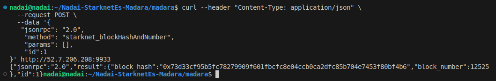

# Sharingan

En este capítulo hablaremos como Sharingan representa una innovadora y transitoria testnet al servicio de Starknet, donde la totalidad de las entidades nodales que conforman la infraestructura son encarnaciones virtuales de Madara. En este entorno de pruebas, la funcionalidad de Starknet es sometida a rigurosas pruebas de campo en un paradigma descentralizado, en el cual los nodos colaboran armoniosamente para determinar la continuación de la cadena mediante un proceso de consenso. La arquitectura subyacente de Sharingan se apoya en la utilización de lo que denominamos **secuenciadores**, elementos cruciales responsables de la producción, validación y anexión de bloques en la cadena de bloques.

No obstante, es importante destacar que algunos nodos dentro de este ecosistema tienen un rol específico en el almacenamiento y retención de datos, sin involucrarse activamente en las decisiones de consenso.

Si bien Madara se refiere comúnmente como el **Secuenciador** en el contexto de Starknet, es relevante establecer una distinción intrínseca en Sharingan entre dos categorías de nodos:

1. **Madara en calidad de Secuenciador**: Partícipe activo en el proceso de consenso y toma de decisiones.
2. **Madara en calidad de Fullnode**: Contribuyente a la persistencia y almacenamiento de datos en la red.

El propósito fundamental que subyace a Sharingan consiste en inaugurar un capítulo de pruebas descentralizadas para Starknet y, simultáneamente, proporcionar un acceso inclusivo y participativo a todos los actores interesados en experimentar con la red Starknet.

Para facilitar la interacción con la red Starknet, los nodos Starknet ofrecen una interfaz de programación de aplicaciones (API) en formato JSON RPC. Como consecuencia, cada instancia de Madara que contribuye al entorno de Sharingan posee un puerto expuesto, diseñado para admitir la comunicación externa.

Se distinguen un total de seis secuenciadores reconocidos dentro del contexto de Sharingan, aunque siempre revise documentación ofical para estar actualizados:

| Mantenedor | ID | Alias de clave | IP | ID de par | Puerto RPC |
|------------|----|-----------|----|---------|----------|
| Starkware  | 1  | alice     | `52.7.206.208` | `12D3KooWJytWW4wqhG1xp9ckLb7B15KqDU24Q8HHo8VfwXmFe5ZE` | `9933` |
| Starkware  | 2  | bob     | `44.195.161.82` | `12D3KooWHocNfvLz6rgpb8wJsynSpMwkspkcRn6gmN5UiK1tTTeG` | `9933` |
| Cartridge  | 3  | charlie     | `208.67.222.222` | `12D3KooWQe2ZtqiyC5CLJKZr9i9xTmEyiAikZcr5J18w3cG1dQAc` | `9933` |
| LambdaClass  | 4  | dave     | `65.109.91.29` | `12D3KooWK8QhFjkGYGyMskDuCyaS1nrhfTfadMeRjJkox4SV32co` | `9933` |
| Pragma  | 5  | eve     | `13.39.22.82` | `12D3KooWGMCGJ517tFor12U9n2v3ax5WNw1pXFdj48hSHYQe6oyJ` | `9933` |
| Kakarot  | 6  | ferdie     | `52.50.242.182` | `12D3KooWHnQ8LC113DgB5cVVyx2mvTN7bBkm75zvzsndr2WhstEE` | `9933` |

Este selecto grupo de secuenciadores desempeña un papel crucial en la gobernanza y operación de Sharingan, aportando una diversidad de perspectivas y recursos para enriquecer el desarrollo y evolución de Starknet en su trayectoria hacia la descentralización.

## Explorando los Recursos de Sharingan
A continuación, proporcionamos un enlace hacia una [guía exhaustiva en español](https://github.com/Nadai2010/Nadai-StarknetEs-Sharingan/blob/master/Gu%C3%ADa-StarknetEs.md) que le brindará una orientación detallada sobre su utilización.

Dentro del marco de esta guía, examinaremos una porción selecta para ilustrar el funcionamiento. Una vez que hayamos establecido una configuración precisa, nos aventuraremos a conectarnos a la interfaz RPC mediante un comando, es importante señalar que tenemos la capacidad de configurar cualquiera de los seis operadores previamente mencionados, siempre y cuando estén operativos.

Realicemos una demostración práctica al invocar el método `starknet_blockHashAndNumber` a través del operador de Starkware, con el propósito de obtener información crucial acerca de un bloque en la red.

```bash
curl --header "Content-Type: application/json" \
  --request POST \
  --data '{
   "jsonrpc": "2.0",
    "method": "starknet_blockHashAndNumber",
    "params": [],
    "id":1
}' http://52.7.206.208:9933
```

La respuesta obtenida deberá proporcionar el hash del bloque más reciente, junto con su número de bloque e identificador:


<div align="center">
</div>

Avanzando, exploramos otro ejemplo, en este caso, empleamos `starknet_getBlockWithTxHashes` para obtener el bloque más reciente, acompañado por su hash relacionado, el estado actual de la transacción, el timestamp (sello de tiempo) y la dirección del secuenciador.

```bash
curl --header "Content-Type: application/json" \
  --request POST \
  --data '{
   "jsonrpc": "2.0",
    "method": "starknet_getBlockWithTxHashes",
    "params": [
        "latest"
    ],
    "id":1
}' http://52.7.206.208:9933
```

La respuesta a esta consulta deberá seguir la estrucutra de salida de la siguiente imagen:


<div align="center">
</div>

En última instancia, proporcionamos el enlace directo al documento hospedado en el repositorio oficial. Este recurso le permitirá mantenerse al tanto de las actualizaciones más recientes y acceder al [Sharingan Starter Pack](https://github.com/keep-starknet-strange/madara/blob/main/docs/sharingan-starter-pack.md) para examinar los **Comandos y Recomendaciones actualizadas**. 