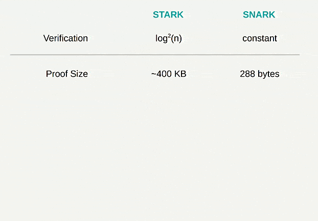
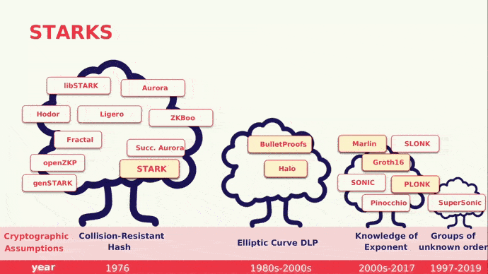

# S-T-ARKs
Ahora, adentrémonos en una de las partes más fascinantes del ecosistema, los **STARKs** [(Scalable Transparent Argument of Knowledge)](https://starkware.co/stark/) que se basan en matemáticas modernas, la existencia de funciones hash criptográficas seguras y resistentes a las colisiones. Los STARKs presentan variados beneficios, entre los cuales tenemos:

1. **Seguridad poscuántica:** los **STARK** son plausiblemente seguros frente a ordenadores cuánticos eficientes.
2. **Eficiencia concreta:** el prover **STARK** es al menos **10 veces más rápido** que el prover SNARK y el prover [Bulletproofs](https://eprint.iacr.org/2017/1066.pdf).

    El verificador **STARK** es al menos **2 veces más rápido** que el verificador **SNARK** y más de **10 veces más rápido** que el verificador **Bulletproof**.

    A medida que StarkWare continúe optimizando **STARKs** estos ratios probablemente mejorarán. Sin embargo, la longitud de una prueba **STARK es ~100x mayor** que la correspondiente **SNARK** y **~20x mayor que BulletProofs**.

Puede encontrar una imagen animada de una comparativa con los datos expuestos sobre el proving time y verification time, tamaño de la prueba, configuración inicial y PQS entre STARKs y SNARKs, veremos cómo cada una cumple con distintas propiedades que les permite ser recomendadas para variados usos.

<em></em>

Ahora que tenemos conceptos más profundos sobre algunos aspectos de la criptografía, funciones hash y las operaciones detrás de cada una, veamos la importancia de la Integridad Computacional (CI), una propiedad fundamental para el día a día. Esta propiedad se refiere a la confianza en que la salida de un cálculo es correcta, permitiéndonos confiar en el saldo de una cuenta o en el monto de una factura en una tienda.

> **Pero, ¿cómo podemos garantizar esta integridad en un entorno digital donde no siempre podemos confiar en todas las partes involucradas?**

Aquí es donde entra en juego la tecnología STARK, que se basa en estas Validity Proof para garantizar que la computación se realice correctamente, **incluso si nadie está observando `“INTEGRO”`**. STARKs utiliza matemáticas para lograr este objetivo y está diseñado para monitorear y garantizar la integridad de un gran cálculo realizado por un grupo de supercomputadoras poco confiables.

Las Validity Proofs son una herramienta crucial para garantizar la integridad y validez de los cambios realizados fuera de la cadena principal. Los sistemas de ZKP, en los que el prover posee información secreta que no es conocida por el verifier, son clave para las Validity Proofs. En el caso de Starknet, se trata de un Validity Rollup que utiliza STARKs.

Es importante tener en cuenta que ZK en Starknet, es una propiedad adicional que se utiliza para afirmar al probador que no tiene que revelar ninguna información incluida en el cálculo. Sin embargo, en el caso de Starknet como una capa 2 pública, los datos de transacción son públicos, lo que significa que no se ofrece privacidad como tal en transacciones, ocultar saldos u otras operaciones opacas, aunque los zk-STRAKs están listas para eso.

En Starknet, el enfoque principal es el Validity Rollup, que se utiliza para probar la validez del cálculo computacional, a diferencia de otros protocolos que utilizan el término `ZK Rollup`. Los STARKs en Starknet son Validity Proofs en lugar de ZK Proofs.

Los STARKs utilizan funciones de criptografía simétrica y hash criptográficos como componentes fundamentales en su construcción, las vulnerabilidades cuánticas conocidas en criptografía, como el algoritmo de Shor que puede factorizar números enteros grandes y romper sistemas de criptografía asimétrica basados en factorización, no afectan a las STARKs.

<em></em>

En la imagen superior, se puede observar que las pruebas pueden basarse en principios de criptografía simétrica o asimétrica, como aprendimos al principio del documento. Además, se pueden apreciar las diferentes propiedades de cada una en cuanto a escalabilidad, transparencia, seguridad en el futuro post-cuántico o tamaño de la prueba.

Como conclusión final antes de pasar a sus propiedades podemos ver para pruebas cortas como se recomienda utilizar **Groth16** o **SNARKs**, mientras que para todo lo demás se sugiere **STARK**. Es importante destacar que este campo se encuentra en constante desarrollo y cada uno sigue optimizando sus propias soluciones. Tanto las **STARKs** como Starknet también experimentarán optimizaciones para mejorar **STARK** y/o admitir diferentes tipos de pruebas. Un ejemplo de esto es como [Keep-Starknet-Strange](https://github.com/keep-starknet-strange) el equipo detrás de [**Garaga**](https://github.com/keep-starknet-strange/garaga), que está trabajando en diversas librerías criptográficas como [Plonk](https://eprint.iacr.org/2019/953.pdf), [Groth16](https://eprint.iacr.org/2016/260.pdf), **SNARK**, entre otras.

Si desea obtener más información sobre como los STARKs están en diversas arquitectura y sus diversos casos de uso para asentar las bases dela criptografía moderna, recomendamos leer el articulo que sacamos para L2 Español [Profundizando en el Ecosistema STARKs](https://mirror.xyz/layer2es.eth/8TUEfpZPgl1u3-HyyGaUA0YMrFm8XSHfYtY6tfqFX7s)